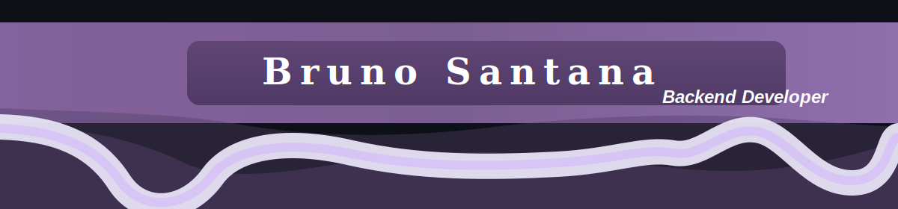

Olá, eu sou Bruno Santana 

Sou estudante de Ciência da Computação, formado em Design Gráfico, com interesse em desenvolvimento de software, tecnologia, inteligência artificial e soluções digitais.

Atualmente estou desenvolvendo minhas habilidades em programação, lógica, backend e ferramentas modernas de desenvolvimento. Tenho também experiência com design, criação visual e pensamento criativo, o que me ajuda a unir tecnologia com uma boa experiência para o usuário.

---

  Sobre mim

-  Estudante de Ciência da Computação
-  Formação em Design Gráfico
-  Interesse em desenvolvimento backend
-  Interesse em Inteligência Artificial
-  Interesse em tecnologia aplicada ao mercado financeiro
-  Atualmente aprendendo lógica de programação, Java, GitHub e desenvolvimento de software
-  Inglês avançado e espanhol intermediário

---

Tecnologias e ferramentas que estou estudando

- Java
- Python
- Git e GitHub
- Lógica de programação
- Flowgorithm
- HTML, CSS e JavaScript
- Banco de dados
- APIs
- Desenvolvimento backend

---

Projetos e interesses

Atualmente estou estudando e praticando projetos relacionados a:

- Algoritmos e lógica de programação
- Sistemas backend
- Aplicações com inteligência artificial
- Análise de dados
- Interfaces digitais
- Automação e ferramentas para produtividade
- Teste de software e qualidade de software

---

Objetivo

Meu objetivo é crescer como desenvolvedor, construir projetos práticos e entrar no mercado de tecnologia, unindo minha base criativa em design com meus estudos em programação e desenvolvimento de sistemas.

---

Como entrar em contato

- GitHub: [BrunoSantanaaa](https://github.com/BrunoSantanaaa)

## Conecte-se comigo

 

- E-mail: bruno.santana@edu.unifil.br
---

Curiosidade

Gosto de aprender tecnologia na prática, criando projetos, testando ferramentas e transformando ideias em soluções reais.
